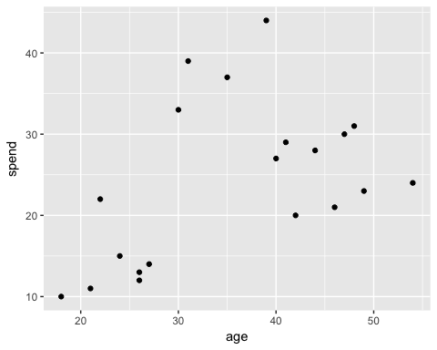

```{r setup, include=FALSE}
knitr::opts_chunk$set(echo = FALSE)
```

## Établir des groupes des pays comparables

### Analyse par grappes

Il est parfois tentant d'utiliser nos expériences, nos connaissances et nos a apriori pour affirmer si des individus sont comparables ou pas. Ce n'est toutefois pas très rigoureux comme démarche. La bonne nouvelle est qu'il existe des outils statistiques pour nous aider à définir des groupes d'individus qui sont comparables sur la base de certains critères. Il s'agit des **analyses par grappes**. 

La façon la plus simple d'illustrer une analyse par grappe est de penser à un nuage de points qui présente la relation entre deux variables. Par la suite, il suffit de regrouper les points (individus) qui sont les plus prês les uns des autres. 

 

Dans cette exemple qui montre la relation entre les dépenses et l'âge des consommateurs, nous voyons rapidement qu'il est facilement possible de définir trois groupes distints. ^[@johnson_k-means_nodate]

Une analyse par grappes de deux dimensions est relativement simple. Malheureusement, c'est souvent bien insuffisant pour bien représenter toutes les complexités et les subtilités d'un groupe d'individus. C'est pourquoi l'analyse par grappes est beaucoup plus sophistiquées qu'une simple analyse d'un nuage de points.


### Des pays comparables selon leur profils de vaccination

Les campagnes de vaccination battent leur plein partout dans le monde dans la lutte qui est actuellement mené contre le virus de la COVID-19. Toutesfois, les pays n'ont pas tous les mêmes réalités, ressources ou stratégies pour déployer leurs campagnes de vaccination. 

Nous utiliserons donc l'analyse par grappes afin d'établir des groupes de pays comparables en fonction de leur profils vaccinales. Afin de donner un peu plus de profondeur à nos analyses, nous croisons le taux de personnes pleinement vaccinées avec des indicateurs supplémentaires tels que la population, le PIB, le PIB par habitant et l'espérance de vie. 


## Mise en garde

### Une initiation à la programmation avec R et RStudio

Au cours de l'automne 2021, le cours *Initiation à la programmation en sciences sociales* offert à l'Université de Montréal nous a permis d'apprendre les bonnes pratiques et méthodes de travail en lien avec des outils nous permettant de faire de la programmation pour réaliser des analyses statistiques. Tout au long de la session, nous avons pu explorer divers outils tels que [R](https://www.r-project.org/), [RStudio](https://www.rstudio.com/), divers packages ([CRAN](https://cran.r-project.org/), [tidyverse](https://www.tidyverse.org/), etc.), [Git](https://git-scm.com/), [GitHub](https://github.com/), [Distill](https://rstudio.github.io/distill/) et [HUGO](https://gohugo.io/). 


### La démarche présentée dans ce rapport

La démarche utilisée pour produire ce rapport se veut rigoureuse et appuyée sur les bonnes pratiques autant en matière de statistiques que de programmation. Étant réalisé dans un contexte d'apprentissage de la programmation, il n'a pas été possible d'aller aussi loin que nous espérions dans le cadre de l'analyse statistique. En d'autres mots, nous sommes conscients notamment que :

- Des éléments d'analyses supplémentaires seraient nécessaires pour compléter l'exploration des données
- Il serait pertinent d'explorer les différentes méthodes d'analyses par grappes (hiérarchique et non hiérarchique)
- Le choix des variables pour réaliser l'analyse par grappes est limité et mériterait d'être raffiné
- Une interprétation des résultats de groupes de pays comparables serait nécessaire

La présente démarche se veut donc une exploration de ce qu'il est possible de faire en matière d'analyse statistique avec des outils de programmation comme R et RStudio. Et laissez-nous vous dire que le résultat est plus que prometteur! ;-)


### Production du rapport

Ce rapport a été produit dans [RStudio](https://www.rstudio.com/) en utilisant le package [Distill](https://rstudio.github.io/distill/) qui permet de générer facilement un site Web optimiser pour communiquer des résultats scientiques et techniques. Le rapport a été rédigé directement dans des *markdown* dans lequel nous avons également réaliser l'ensemble des manipulations et des analyses à l'aide de lignes de codes ou de scripts. 

[Git](https://git-scm.com/) et [GitHub](https://github.com/) ont été utilisé pour faire le contrôle des versions. GitHub est également utilisé pour rendre disponible le site web en ligne. 


## Structure de l'analyse

L'ensemble des démarches et des analyses effectuées pour établir des groupes de pays comparables selon leurs profils de vaccination sont présentées dans les différentes sections de ce site. 

- [**Importation et préparation des données**](docs/2-import.html). Cette section présente les données utilisées dans ce rapport ainsi que les manipulations qui ont été nécessaire pour préparer les données aux analyses. 
- [**Exploration des données**](docs/3-exploration.html). Cette section présente les données contenues dans le jeu de données. Elle permet notamment de prendre connaissance des statistiques relatives aux différentes variables d’intérêt et de visualiser leur distribution.
- [**Établir des groupes de pays comparables** (ou analyses)](docs/4-analysis.html). Cette section présente les analyses réalisées pour établir des groupes de pays comparables selon leur profil de vaccination.
- [**Visualisation des données**](docs/5-visualisation.html). Cette section présente quelques visualisations des données à partir des groupes de pays comparables établis. 


## Remerciements {.appendix}

Merci à Samuel Guay! Merci pour ta passion et ton enthousiasme à résoudre des problèmes de programmations ou de données! Merci pour ton ouverture et ta patience!
